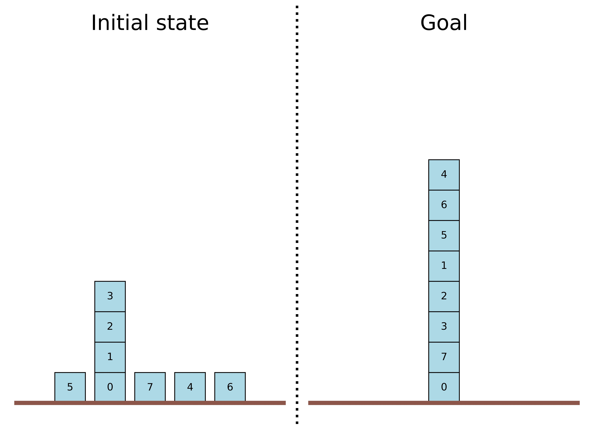
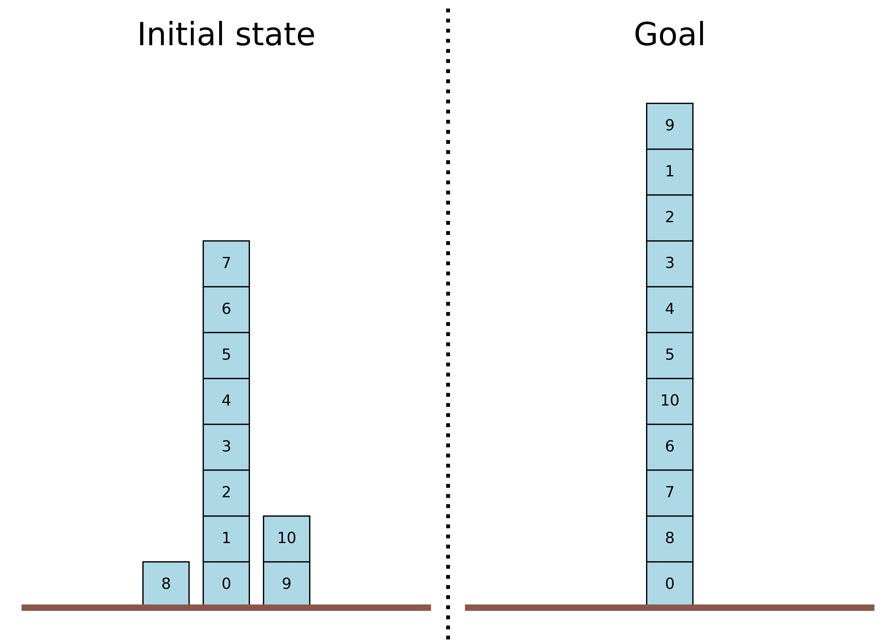
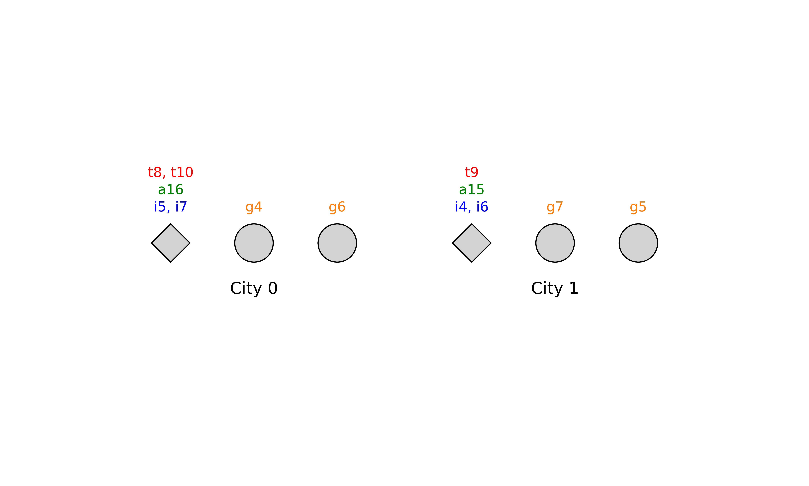
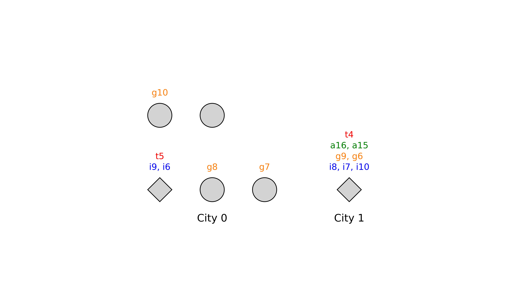
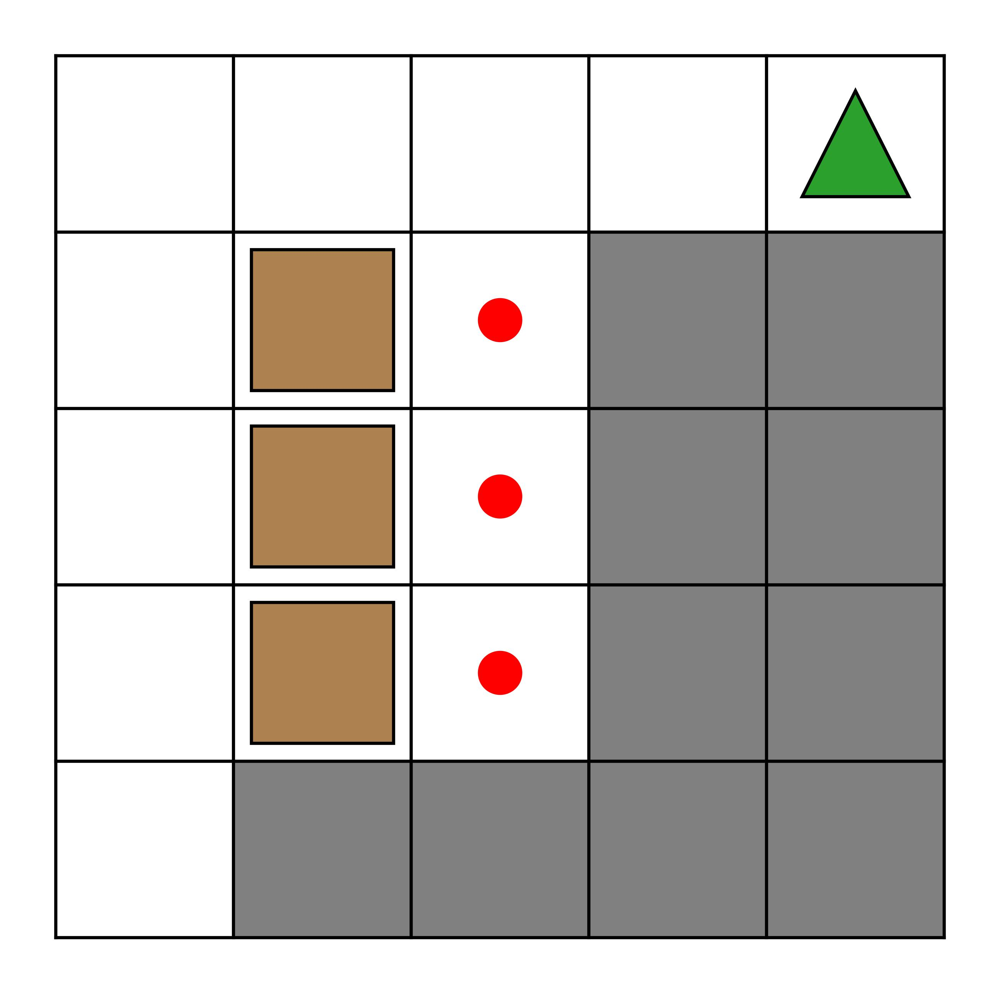
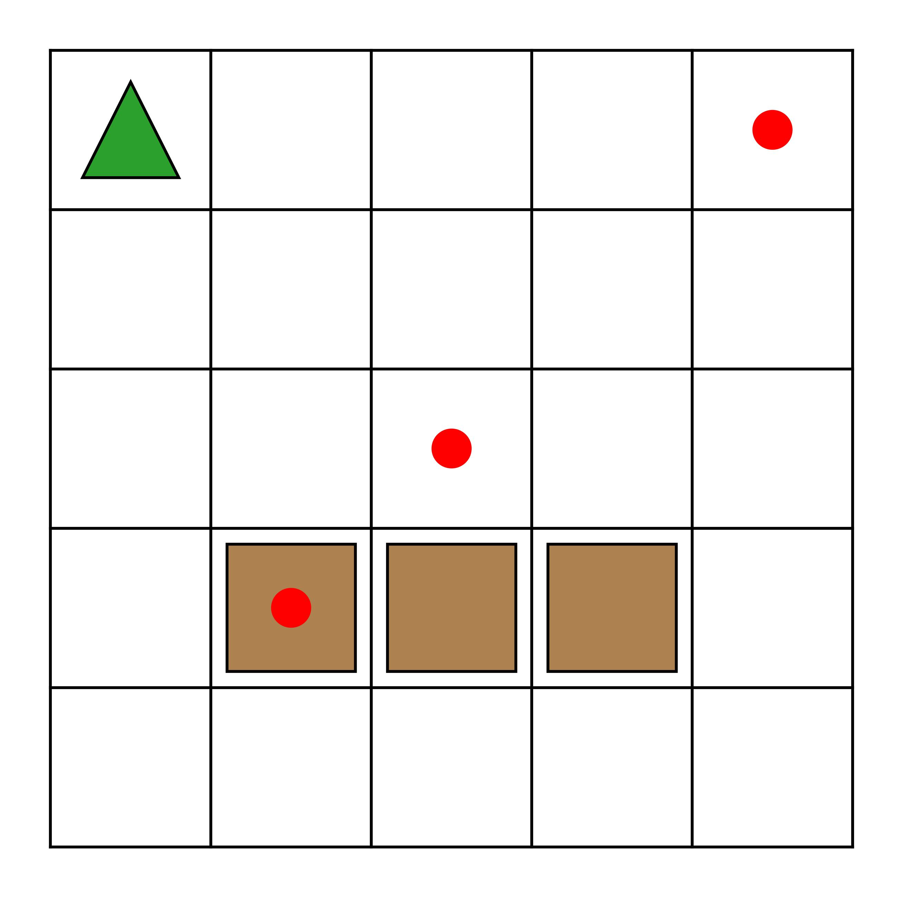
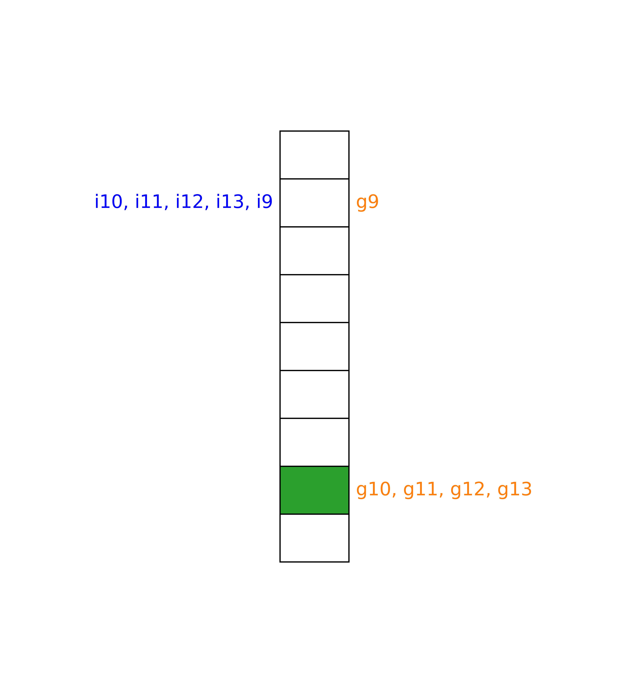
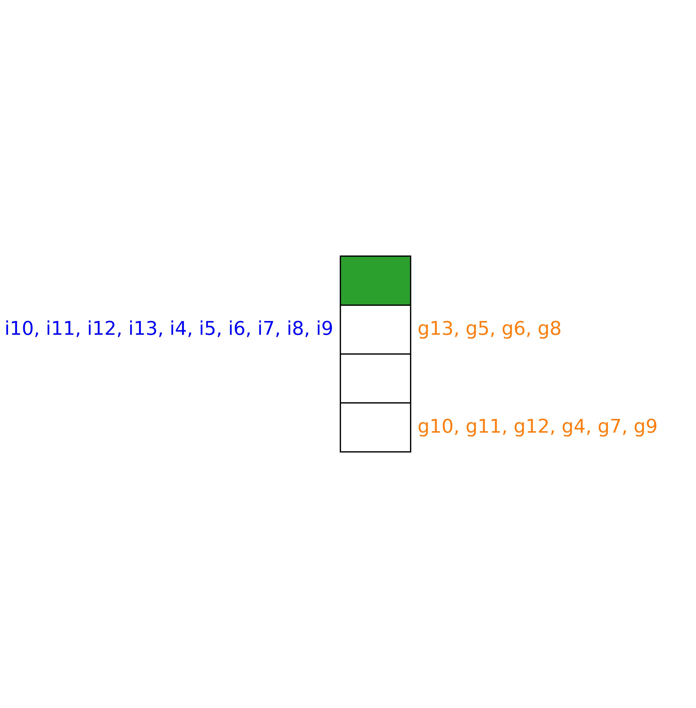
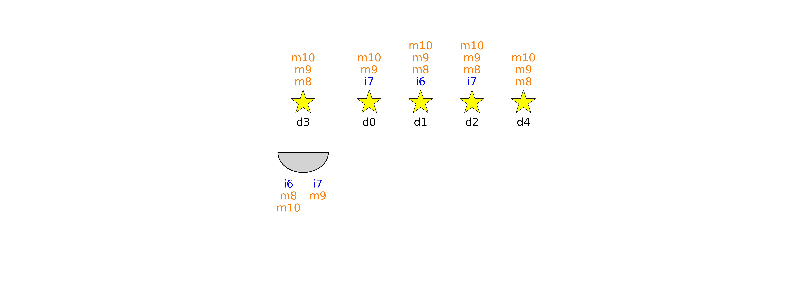
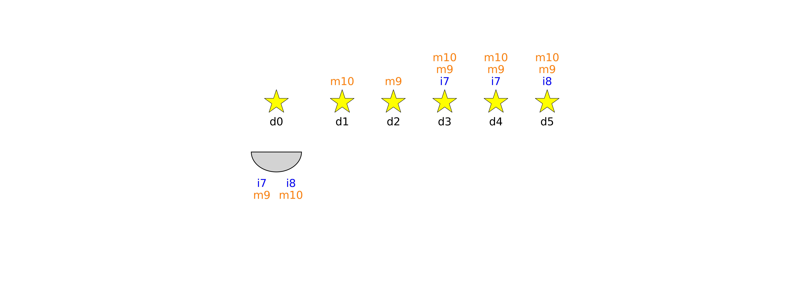

# PDDL Problem Visualizer

A simple Python script for obtaining a visual representation of a PDDL planning problem. At the moment, we support the following domains: *blocksworld*, *logistics*, *sokoban*, *miconic* and *satellite*.

## Example visualizations
### Blocksworld

### Logistics

### Sokoban

### Miconic

### Satellite

All PDDL problems were automatically generated by [**NeSIG**](https://github.com/ari-dasci/S-PlanningProblemGeneration).
For understanding what each object/text item means, please take a look inside `problem_visualizer.py`.

## How to use
Simply call `problem_visualizer.py` with the path to the PDDL problem file, an optional output image path and the name of the associated domain (e.g., "blocksworld"). Additionally, you can specify several domain-specific arguments (e.g., for blocksworld, the size in pixels of each block).

    python problem_visualizer.py bw_problem_0.pddl -o problem_img.jpg blocksworld

**Important:** this script requires access to the PDDL domain associated with each problem and assumes that domains are located in the `domain` folder provided as part of the repository. If you want to change the domain location, simply modify the `domain_path_dict` variable inside the script. Also, it assumes a particular PDDL domain encoding for each of the five domains listed above. In other words, if you provide your own PDDL domain description with, e.g., different predicate names, it will not work.

## Disclaimer
Most of the code was generated with ChatGPT (I'm lazy sorry :P).
